# Waveform

Waveform is a Spotify clone where users can come to listen, share, and socialize about music. It is a fullstack React App made with a Redux state manager and a backend using Python, Flask, SQL-Alchemy, PostgresSQL and other technologies.

-   View the <a href='https://waveform-app.herokuapp.com/'>Waveform</a> App Live

-   Reference to the Waveform <a href='https://www.github.com/jujmart/Waveform/wiki'>Wiki Docs</a>

| Table of Contents                                                        |
| ------------------------------------------------------------------------ |
| 1. [Features](#features)                                                 |
| 2. [Installation](#installation)                                         |
| 3. [Technical Implementation Details](#technical-implementation-details) |
| 4. [Future Features](#future-features)                                   |
| 5. [Contact](#contact)                                                   |
| 6. [Special Thanks](#special-thanks)                                     |

## Technologies

-   <a href="https://developer.mozilla.org/en-US/docs/Web/JavaScript"></a>
-   <a href="https://www.postgresql.org/"></a>
-   <a href="https://nodejs.org/"></a>
-   <a href="https://reactjs.org/"></a>
-   <a href="https://redux.js.org/"></a>
-   <a href="https://developer.mozilla.org/en-US/docs/Web/CSS"></a>
-   <a href="https://www.python.org/"></a>
-   <a href="https://flask.palletsprojects.com/"></a>
-   <a href="https://www.heroku.com/home"></a>
-   <a href="https://alembic.sqlalchemy.org/">Alembic</a>

## Features

### Login and Sign Up
---

<br/><br/>
Login
<!-- 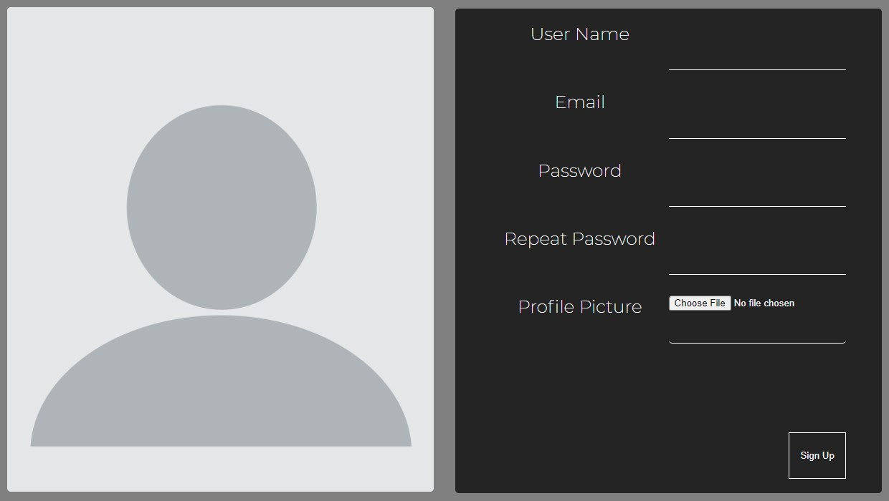 -->

<!-- 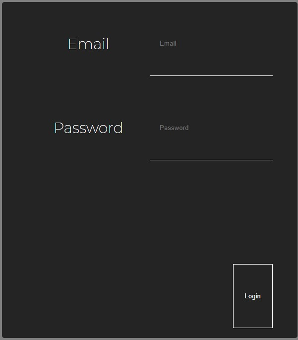 -->

<br/><br/>
Sign Up
<!--  -->


<br/><br/>

### Feed Page
Waveform feed displays most recent songs and playlists


---
<br/><br/>
<!-- 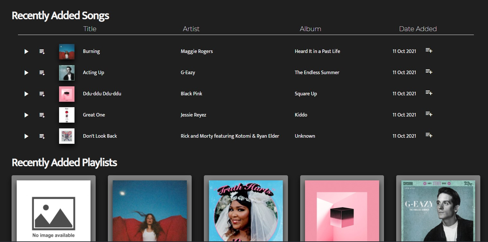 -->

<br/><br/>

### Add Songs
Add a new song to the database

---
<br/><br/>
<!-- 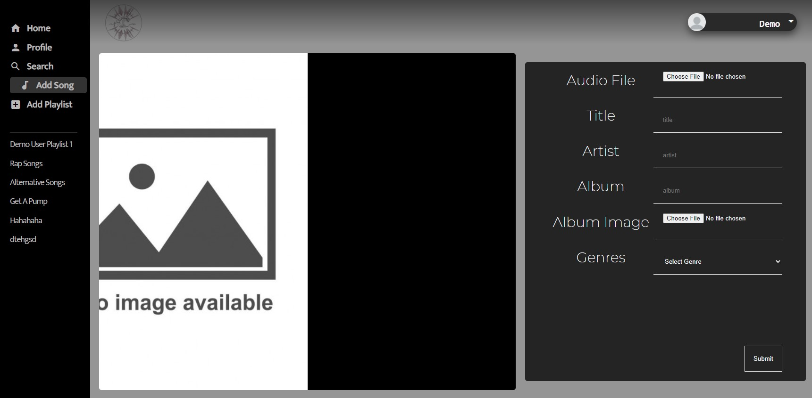 -->


<br/><br/>

### Edit Songs
Edit a song in the database

---
<br/><br/>
<!-- 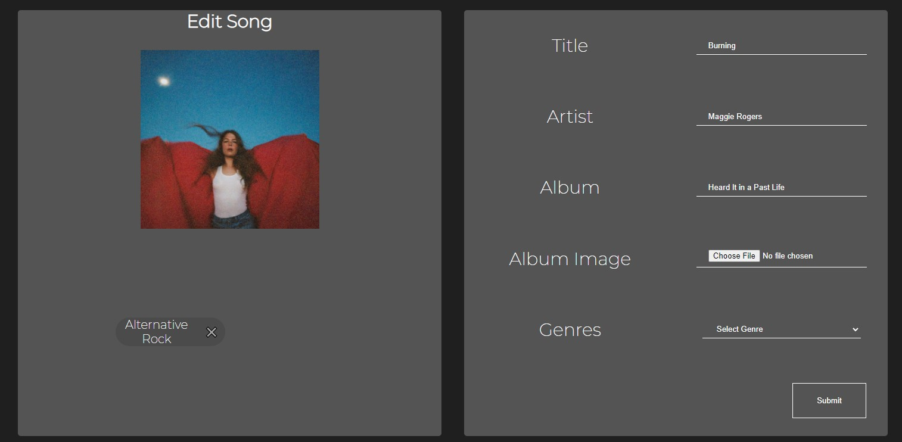6 -->


<br/><br/>

### View and Delete Songs
Delete a song from the database

---
<br/><br/>
<!-- 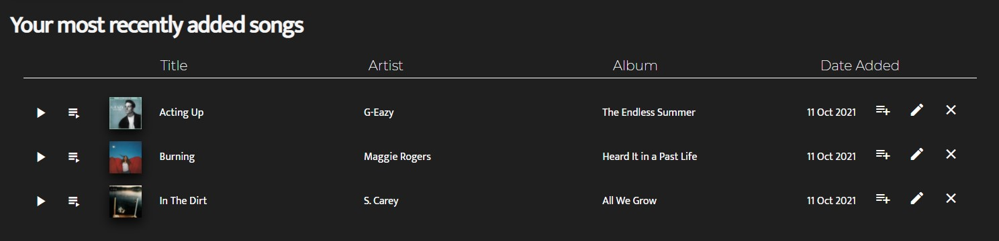 -->


<br/><br/>

### View Playlist
Single playlist and the songs within it

---
<br/><br/>
<!-- 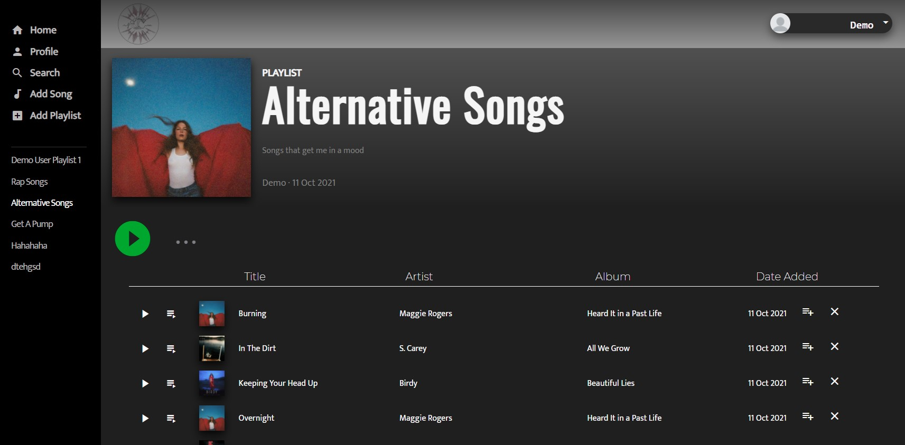 -->


<br/><br/>

### Add Playlists
Add a new playlist to the database

---
<br/><br/>
<!-- 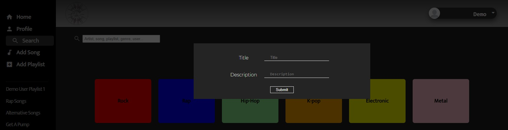 -->


<br/><br/>

### Edit Playlists
Edit a playlist in the database

---
<br/><br/>
<!-- 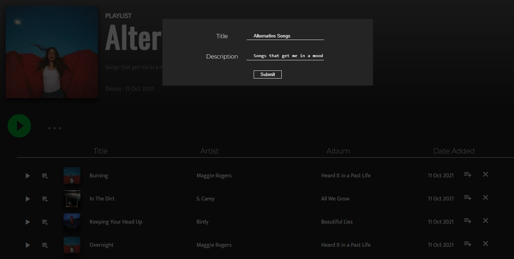 -->


<br/><br/>

### Delete Playlists
Delete a playlist from the database

---
<br/><br/>
<!-- 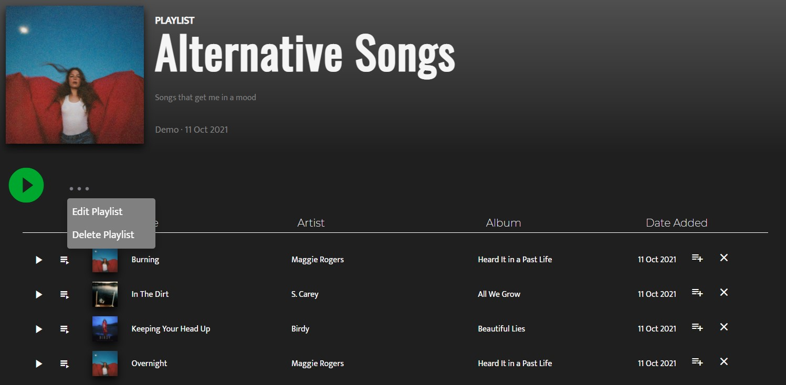 -->


<br/><br/>

### Follow Users & Followed Users Tower
The "Followed Users" feed displays other users that you have followed


---
<br/><br/>
<!--  -->
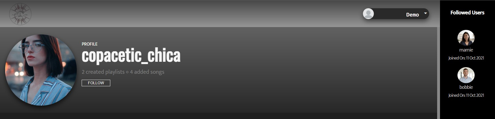

<br/><br/>

### Search
Discover and search for new Songs, Playlists & Users

---
<br/><br/>
<!--  -->
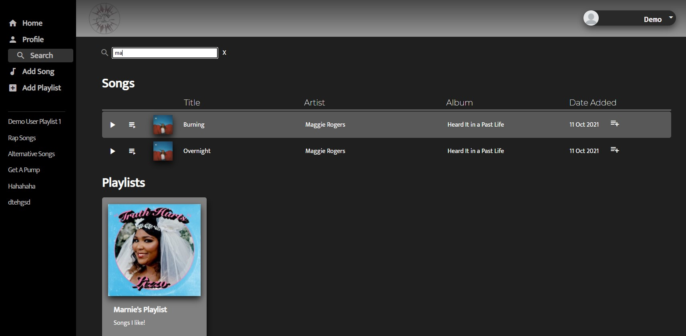
<br/><br/>
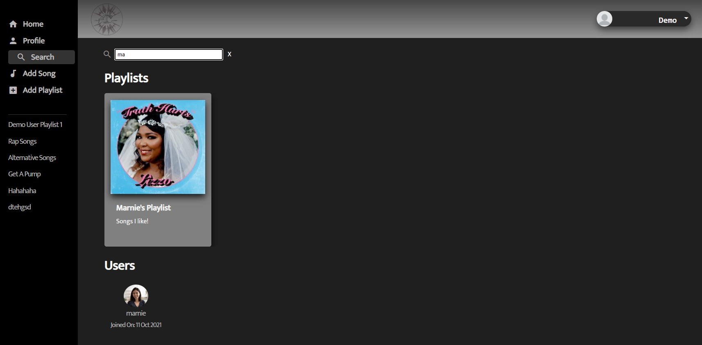

<br/><br/>

## Installation

To build/run project locally, please follow these steps:

1. Clone this repository

```shell
git clone https://github.com/jujmart/Waveform.git
```

2. Install Pipfile dependencies and create the virtual environment

```shell
pipenv install
```

2. Install npm dependencies for the `/react-app`

```shell
cd react-app
npm install
```

3. In the `/` root directory, create a `.env` based on the `.env.example` with proper settings

4. Setup your PostgreSQL user, password and database and ensure it matches your `.env` file

5. Before running any flask commands, confirm you are in the pipenv virtual env. If not, run the command:

```shell
pipenv shell
```

6. In the root folder, migrate tables to the database by running in the terminal:

```shell
flask db upgrade head
```

7. In the root folder, seed the database by running in the terminal:

```shell
flask seed all
```

8. Start the flask backend in the `/` root directory

```shell
flask run
```

9. Start the frontend in the `/react-app` directory

```shell
npm start
```

## Technical Implementation Details

### {Detail 1}

Description 1

Part of code is shown below:

```python
print('add code snippet 1 here')
```

Description 2

```javascript
print("add code snippet 2 here");
```

### {Detail 2}

Description 1

Code snippet is shown here:

```javascript
print("add code snippet 1 here");
```

## Future Features

1. **Search** - search {resource-1-plural}

2. **Music Shuffle** - ability to shuffle songs randomly

3. **Order Playlist Songs** - ability to order songs within playlist

## Contact

### Justice Martin

<a href="https://www.linkedin.com/in/justice-martin-34043340/"></a>

<!-- <a href="https://angel.co/u/{angel-list-handle}"></a> -->

<a href="https://github.com/jujmart"></a>

jujmart12@gmail.com

### Maxwell Wehner

<a href="https://www.linkedin.com/in/maxwell-wehner-7a2066220/"></a>

<!-- <a href="https://angel.co/u/{angel-list-handle}"></a> -->

<a href="https://github.com/MaxwellWehner"></a>

maxwehnerwork@gmail.com

### Andrew Watkins

<a href="https://www.linkedin.com/in/andrew-watkins-533280173/"></a>

<!-- <a href="https://angel.co/u/{angel-list-handle}"></a> -->

<a href="https://github.com/andru17urdna"></a>

dr3wwatkins@gmail.com
